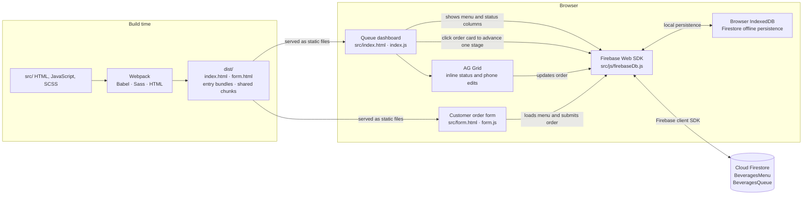

# Beverages Menu and Ordering App

A browser-based beverage ordering and queue-management app. Customers can browse
the menu and place an order; the main page displays orders by preparation status
and provides a grid for staff to update order details and status.

## Architecture



Webpack builds two HTML pages from `src/` into `dist/`. The dashboard and order
form use separate entry points, with common dependencies emitted as shared
chunks. Both browser pages access Cloud Firestore through the shared Firebase
module; the dashboard reads and updates orders, while the order form reads the
menu and creates orders. GitHub Actions deploys the production build to GitHub
Pages.

## Features

- Loads the beverage menu and orders from Cloud Firestore.
- Submits customer name, phone number, address, selected beverage, and order
  timestamps to the `BeveragesQueue` collection.
- Displays orders in four stages: In queue, Being mixed, Ready to collect, and
  Collected. In the normal queue view, clicking an order card advances it one
  stage: In queue → Being mixed → Ready to collect → Collected. Collected is the
  final stage.
- Provides a grid view where staff can edit an order's status directly in its
  row, as well as edit phone numbers. The status editor allows the current or a
  later stage. The grid also supports filtering, sorting, row selection, bulk
  status changes, and selectable page sizes.
- Enables Firestore IndexedDB persistence where the browser supports it.

## Requirements

- Node.js `^22.18.0` or `>=24.11.0` (as specified in `package.json`).
- npm.
- A Firebase project configured for the app.

## Getting started

Install dependencies:

```sh
npm install
```

Build the production files into `dist/`:

```sh
npm run build
```

Start the webpack development server:

```sh
npm run start:dev
```

In PowerShell, if script execution policy prevents the `npm.ps1` shim from
running, invoke npm's Windows command shim instead:

```powershell
npm.cmd install
npm.cmd run build
npm.cmd run start:dev
```

## Deploy to GitHub Pages

The GitHub Actions workflow in `.github/workflows/deploy-pages.yml` builds the
site and deploys it to Pages whenever changes are pushed to `master`. It can
also be started manually from the repository's **Actions** tab using the
**Deploy GitHub Pages** workflow.

For this repository, the expected site URL is:

<https://bangarraju.github.io/beverages/>

The workflow enables Pages if the repository has not been initialized for Pages
yet. The repository must allow GitHub Actions to manage Pages; if the workflow
cannot enable it, open **Settings → Pages** and set the build and deployment
source to **GitHub Actions**. After the workflow succeeds, the workflow's
deployment environment shows the published URL. The order form is available at
`/beverages/form.html`.

The Pages build sets Webpack's asset base to `/beverages/`, so shared JavaScript
chunks load correctly from the repository subpath. Local builds keep Webpack's
automatic public path.

## Firebase setup

The Firebase client configuration is in `src/js/firebaseDb.js`. Client Firebase
configuration is visible in browser code and is not a server-side secret. Do not
put service-account credentials or other private keys in this app.

Create these Cloud Firestore collections:

- `BeveragesMenu`: one document per menu item. Each document should include
  `Name` and `BeverageId` string fields.
- `BeveragesQueue`: created by the app when an order is submitted. Documents
  include `customerName`, `phoneNumber`, `address`, `OrderedBeverage`,
  `OrderCreatedTimeStamp`, `OrderDeliveredTimeStamp`, `BeverageBarOrderId`, and
  the `IsBeingMixed`, `IsReadyToCollect`, and `IsCollected` status flags.

Configure **Cloud Firestore Security Rules** in the Firebase project before using
the app. The app has no authentication or staff sign-in flow, yet order documents
contain customer names, phone numbers, and addresses. Do not make order reads
public; choose an access design that protects customer data and fits the way the
app is deployed. A Firestore `permission-denied` error means the deployed
Firestore rules do not allow the attempted operation.

GitHub Pages is public static hosting. Deploying the frontend does not make
Firestore private or secure it; anyone can inspect the client code and Firebase
configuration. Configure and test Firestore rules before publishing, and do
not deploy customer data with public read access.

`firebase.json` currently points to `database.rules.json`, which configures
**Realtime Database**, not Cloud Firestore. It does not provide Firestore rules.
Firestore rules must be configured separately in Firebase or added to the
Firebase CLI configuration before deploying them.

The Firebase project selection is stored in `.firebaserc`. Check that it points
to the intended project before running any Firebase CLI deployment commands.

## Project structure

```text
src/
  index.html          Main menu, queue, and grid page
  form.html           Customer order form
  js/
    beverage.js       Creates orders and advances queue items
    firebaseDb.js     Firebase initialization and Firestore operations
    form.js           Order-form population and validation
    gridView.js       AG Grid configuration and order updates
    index.js          Main-page rendering and view controls
    nodeOperations.js Small DOM helpers
    service.js        Legacy Axios client
  styles/
    form.scss         Order-form styles
    main.scss         Main-page styles
dist/                 Generated webpack output
```

The `db.json` file contains sample menu and order data; the browser app reads
from Firestore rather than loading that file directly. There is no test script
defined in `package.json`.
